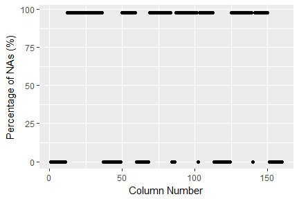

## Synopsis:

In this report, analyses are performed on a *Weight Lifting Exercises* (*WLE*) dataset relating to human activity recognition research. Detailed information on this data can be found [HERE][1], and you can also read the authors' paper, [Qualitative Activity Recognition of Weight Lifting Exercises][2]. In their study, six male participants between the ages of 20-28 years were asked to perform bicep curls with 1.25 kg dumbbells in five different ways (both correct and incorrect forms) as is denoted by the *classe* variable in the dataset. The exercises performed are indicated in the dataset as:  

- *Classe A*: Correct form
- *Classe B*: Throwing elbows forward
- *Classe C*: Lifting dumbbells halfway
- *Classe D*: Lowering dumbbells halfway
- *Classe E*: Throwing hips forward

Each participant wore sensors on the arm, forearm, belt, and dumbbell which recorded specific motions during each dumbbell lift. From this data, machine learning algorithms will be applied to develop a model that can accurately predict what type of bicep curl is being performed based on the motion of the participants' bodies during each exercise. The following sections in this report will detail the development of this prediction algorithm.  

## Data Processing:

The following are the necessary packages that are needed for the analyses performed in this report.  


```r
library(caret)
library(ggplot2)
library(parallel)
library(doParallel)
library(xtable)
```

Before any machine learning can begin, the data is first accessed and read, which is performed in the following code chunk.  


```r
data.train <- read.csv("https://d396qusza40orc.cloudfront.net/predmachlearn/pml-training.csv",
                 stringsAsFactors = FALSE, na.strings = c("", "NA"))
data.val <- read.csv("https://d396qusza40orc.cloudfront.net/predmachlearn/pml-testing.csv",
                    stringsAsFactors = FALSE, na.strings = c("", "NA"))
```

In these datasets, the training data (*data.train*) is comprised of 19622 observations of 160 variables while the validation data (*data.val*) is comprised of 20 observations with the same variables. The only difference between them is that the *classe* variable has been removed from the validation dataset since the primary goal is to make blind predictions of the *classe* outcome for each of these 20 observations. It is important to explore the dataset in order to determine what data cleaning needs to be performed. The following code chunk generates a graph that illustrates the amount of *NAs* in the dataset.  


```r
df <- data.frame(x = 1:ncol(data.train),
                 y = (colSums(is.na(data.train))/nrow(data.train)*100))
g <- qplot(x, y, data = df, xlab = "Column Number", ylab = "Percentage of NAs (%)")
print(g)
```


***Figure 1.* Plot of the percentage of *NAs* in each column of the *WLE* dataset.**  

In *Figure 1*, it is shown that of the 160 columns in the *WLE* dataset, a large number of them are comprised of nearly 100% *NAs* while the rest do not have any *NAs*. Because of this, the data will be cleaned by subsetting only the columns that do not contain *NA* values. In addition, the first 7 columns of the dataset are participant specific, such as ID, name, and time, which do not relate to the sensor data of interest; therefore, the first 7 columns are omitted from the training, testing, and validation datasets. After these data cleaning steps, the datasets are reduced from 160 to 53 variables. Finally, the *data.train* data frame is partitioned into training and testing datasets comprised of 75% and 25% of the data, respectively. These data cleaning and partitioning steps are performed in the following code chunk.  


```r
ind <- colSums(is.na(data.train)) == 0
trn.set <- data.train[,ind]; trn.set <- trn.set[,-(1:7)]
val.set <- data.val[,ind]; val.set <- val.set[,-(1:7)]
trn.set$classe <- as.factor(trn.set$classe)
set.seed(32786)
inTrain <- createDataPartition(trn.set$classe, p = 0.75, list = FALSE)
training <- trn.set[inTrain,]
testing <- trn.set[-inTrain,]
```

## Model Fitting:

Using the training dataset partitioned previously, the *train()* function in the *caret* package is used to generate 3 models using linear discriminant analysis (*LDA*), gradient boosting machine (*GBM*), and random forest (*RF*) methods. For each of these models, *5-fold* cross validation is performed, and in order to maximize computational efficiency, the models are generated using parallel computing. The *LDA*, *GBM*, and *RF* methods were chosen for this report since they represent a range of different machine learning approaches. For each model, the *classe* variable is the outcome with the remaining 52 variables being used as the predictor variables. The following code chunk demonstrates the generation of these 3 models.  


```r
cluster <- makeCluster(detectCores() - 1)
registerDoParallel(cluster)
trnCntrl <- trainControl(method = "cv", number = 5, allowParallel = TRUE)
model.lda <- train(classe ~ ., method = "lda",
                   trControl = trnCntrl, data = training)
model.gbm <- train(classe ~ ., method = "gbm", verbose = F,
                   trControl = trnCntrl, data = training)
model.rf <- train(classe ~ ., method = "rf",
                  trControl = trnCntrl, data = training)
stopCluster(cluster)
registerDoSEQ()
```

From the above prediction models, each model is used to predict the *classe* outcomes for the training and testing datasets. The predictions are then compared with the reference values using the *confusionMatrix()* function in the next code chunk.  


```r
pred.trn.lda <- predict(model.lda, newdata = training)
pred.trn.gbm <- predict(model.gbm, newdata = training)
pred.trn.rf <- predict(model.rf, newdata = training)
pred.tst.rf <- predict(model.rf, newdata = testing)
pred.tst.gbm <- predict(model.gbm, newdata = testing)
pred.tst.lda <- predict(model.lda, newdata = testing)
cm.trn.lda <- confusionMatrix(pred.trn.lda, training$classe)
cm.trn.gbm <- confusionMatrix(pred.trn.gbm, training$classe)
cm.trn.rf <- confusionMatrix(pred.trn.rf, training$classe)
cm.tst.lda <- confusionMatrix(pred.tst.lda, testing$classe)
cm.tst.gbm <- confusionMatrix(pred.tst.gbm, testing$classe)
cm.tst.rf <- confusionMatrix(pred.tst.rf, testing$classe)
```

### Accuracy of Models:

From the confusion matrices generated previously, the testing dataset predictions versus reference tables for the *LDA*, *GBM*, and *RF* models are provided in *Table 1*, which is generated from the following code chunk.  


```r
t.lda <- cm.tst.lda$table; t.gbm <- cm.tst.gbm$table; t.rf <- cm.tst.rf$table
xt1 <- data.frame(Reference=row.names(t.lda), A.lda=t.lda[1,], B.lda=t.lda[2,],
                  C.lda=t.lda[3,], D.lda=t.lda[4,], E.lda=t.lda[5,],
                  A.gbm=t.gbm[1,], B.gbm=t.gbm[2,], C.gbm=t.gbm[3,],
                  D.gbm=t.gbm[4,], E.gbm=t.gbm[5,], A.rf=t.rf[1,],
                  B.rf=t.rf[2,], C.rf=t.rf[3,], D.rf=t.rf[4,], E.rf=t.rf[5,])
xt1 <- xtable(xt1, align = c(rep("c", 17)))
print(xt1, type = "html", include.rownames = FALSE,
      html.table.attributes = "align = 'center', border = 0, width = 100%")
```

<!-- html table generated in R 3.5.0 by xtable 1.8-2 package -->
<!-- Fri Aug 24 09:40:21 2018 -->
<table align = 'center', border = 0, width = 100%>
<tr> <th> Reference </th> <th> A.lda </th> <th> B.lda </th> <th> C.lda </th> <th> D.lda </th> <th> E.lda </th> <th> A.gbm </th> <th> B.gbm </th> <th> C.gbm </th> <th> D.gbm </th> <th> E.gbm </th> <th> A.rf </th> <th> B.rf </th> <th> C.rf </th> <th> D.rf </th> <th> E.rf </th>  </tr>
  <tr> <td align="center"> A </td> <td align="center"> 1161 </td> <td align="center">  32 </td> <td align="center">  95 </td> <td align="center"> 103 </td> <td align="center">   4 </td> <td align="center"> 1379 </td> <td align="center">   8 </td> <td align="center">   6 </td> <td align="center">   2 </td> <td align="center">   0 </td> <td align="center"> 1393 </td> <td align="center">   2 </td> <td align="center">   0 </td> <td align="center">   0 </td> <td align="center">   0 </td> </tr>
  <tr> <td align="center"> B </td> <td align="center"> 146 </td> <td align="center"> 620 </td> <td align="center"> 113 </td> <td align="center">  33 </td> <td align="center">  37 </td> <td align="center">  20 </td> <td align="center"> 907 </td> <td align="center">  22 </td> <td align="center">   0 </td> <td align="center">   0 </td> <td align="center">   2 </td> <td align="center"> 946 </td> <td align="center">   1 </td> <td align="center">   0 </td> <td align="center">   0 </td> </tr>
  <tr> <td align="center"> C </td> <td align="center">  83 </td> <td align="center">  78 </td> <td align="center"> 578 </td> <td align="center"> 103 </td> <td align="center">  13 </td> <td align="center">   0 </td> <td align="center">  28 </td> <td align="center"> 821 </td> <td align="center">   6 </td> <td align="center">   0 </td> <td align="center">   0 </td> <td align="center">   5 </td> <td align="center"> 842 </td> <td align="center">   8 </td> <td align="center">   0 </td> </tr>
  <tr> <td align="center"> D </td> <td align="center">  50 </td> <td align="center">  44 </td> <td align="center">  93 </td> <td align="center"> 581 </td> <td align="center">  36 </td> <td align="center">   1 </td> <td align="center">   0 </td> <td align="center">  30 </td> <td align="center"> 762 </td> <td align="center">  11 </td> <td align="center">   0 </td> <td align="center">   0 </td> <td align="center">   7 </td> <td align="center"> 794 </td> <td align="center">   3 </td> </tr>
  <tr> <td align="center"> E </td> <td align="center">  29 </td> <td align="center"> 174 </td> <td align="center">  81 </td> <td align="center">  99 </td> <td align="center"> 518 </td> <td align="center">   3 </td> <td align="center">   6 </td> <td align="center">   8 </td> <td align="center">  13 </td> <td align="center"> 871 </td> <td align="center">   0 </td> <td align="center">   0 </td> <td align="center">   0 </td> <td align="center">   3 </td> <td align="center"> 898 </td> </tr>
   </table>
***Table 1.* Confusion matrices for the *LDA*, *GBM*, and *RF* prediction models when applied to the testing dataset. Column names ending in *.lda*, *.gbm*. and *.rf* refer to predictions from the *LDA*, *GBM*, and *RF* models, respectively. The column names indicate what the predicted *classe* is while the row names indicate what the correct *classe* should be from the reference data.**  

In *Table 1*, it is evident that the *LDA* model performs the worst when applied to the testing datset. The *GBM* model performs significantly better, but it appears from the confusion matrix that the *RF* model provides the most accurate predictions. In order to quantify the accuracy of each model, the accuracies for all 3 models when applied to both the training and testing datasets are shown in *Table 2*, which is generated in the following code chunk.  


```r
acc.trn <- NULL; acc.tst <- NULL
acc.trn[1] <- cm.trn.lda$overall["Accuracy"][[1]]
acc.trn[2] <- cm.trn.gbm$overall["Accuracy"][[1]]
acc.trn[3] <- cm.trn.rf$overall["Accuracy"][[1]]
acc.tst[1] <- cm.tst.lda$overall["Accuracy"][[1]]
acc.tst[2] <- cm.tst.gbm$overall["Accuracy"][[1]]
acc.tst[3] <- cm.tst.rf$overall["Accuracy"][[1]]
xt2 <- data.frame(Method = c("LDA", "GBM", "RF"), Training.Set = acc.trn,
                 Testing.Set = acc.tst)
xt2 <- xtable(xt2, align = c(rep("c", 4)), digits = c(rep(4,4)))
print(xt2, type = "html", include.rownames = FALSE,
      html.table.attributes = "align = 'center', border = 0, width = 35%")
```

<!-- html table generated in R 3.5.0 by xtable 1.8-2 package -->
<!-- Fri Aug 24 09:40:21 2018 -->
<table align = 'center', border = 0, width = 35%>
<tr> <th> Method </th> <th> Training.Set </th> <th> Testing.Set </th>  </tr>
  <tr> <td align="center"> LDA </td> <td align="center"> 0.7040 </td> <td align="center"> 0.7051 </td> </tr>
  <tr> <td align="center"> GBM </td> <td align="center"> 0.9723 </td> <td align="center"> 0.9666 </td> </tr>
  <tr> <td align="center"> RF </td> <td align="center"> 1.0000 </td> <td align="center"> 0.9937 </td> </tr>
   </table>
***Table 2.* Accuracy calculations when using three different models to predict the *classe* outcomes for the training and testing datasets.**  

As suggested from *Table 1*, the data in *Table 2* indicates that the *LDA* model has the lowest accuracy followed by *GBM* with the *RF* model providing the highest accuracy. In order to maximize the accuracy of the desired predictions, the *RF* model will be used to make the final validation predictions in this report. Specifically, the accuracy for the *RF* model when applied to the testing dataset is *99.4%*, which means that we can expect the out of sample error rate to be approximately *0.6%*. A detailed summary of this *RF* model is provided here:  


```r
print(model.rf)
```

```
## Random Forest 
## 
## 14718 samples
##    52 predictor
##     5 classes: 'A', 'B', 'C', 'D', 'E' 
## 
## No pre-processing
## Resampling: Cross-Validated (5 fold) 
## Summary of sample sizes: 11774, 11775, 11774, 11775, 11774 
## Resampling results across tuning parameters:
## 
##   mtry  Accuracy   Kappa    
##    2    0.9921865  0.9901152
##   27    0.9927978  0.9908893
##   52    0.9859355  0.9822075
## 
## Accuracy was used to select the optimal model using the largest value.
## The final value used for the model was mtry = 27.
```

## Summary:

The data analysis performed in this report resulted in a machine learning prediction algorithm using the *random forest* method that provides an expected out of sample error rate of *0.6%*. This prediction model is applied to the validation dataset, and these predicted *classe* outcomes are provided in *Table 3*, which is generated from the upcoming code chunk. Based on the expected out of sample error rate, it is expected that at least 19, but probably all 20, of these predictions are correct.  


```r
pred.val.set <- predict(model.rf, val.set)
xt3 <- data.frame(ID = data.val$X, Participant = data.val$user_name,
                  Prediction = pred.val.set)
xt3 <- xtable(xt3, align = c(rep("c", 4)))
print(xt3, type = "html", include.rownames = FALSE,
      html.table.attributes = "align = 'center', border = 0, width = 35%")
```

<!-- html table generated in R 3.5.0 by xtable 1.8-2 package -->
<!-- Fri Aug 24 09:40:21 2018 -->
<table align = 'center', border = 0, width = 35%>
<tr> <th> ID </th> <th> Participant </th> <th> Prediction </th>  </tr>
  <tr> <td align="center">   1 </td> <td align="center"> pedro </td> <td align="center"> B </td> </tr>
  <tr> <td align="center">   2 </td> <td align="center"> jeremy </td> <td align="center"> A </td> </tr>
  <tr> <td align="center">   3 </td> <td align="center"> jeremy </td> <td align="center"> B </td> </tr>
  <tr> <td align="center">   4 </td> <td align="center"> adelmo </td> <td align="center"> A </td> </tr>
  <tr> <td align="center">   5 </td> <td align="center"> eurico </td> <td align="center"> A </td> </tr>
  <tr> <td align="center">   6 </td> <td align="center"> jeremy </td> <td align="center"> E </td> </tr>
  <tr> <td align="center">   7 </td> <td align="center"> jeremy </td> <td align="center"> D </td> </tr>
  <tr> <td align="center">   8 </td> <td align="center"> jeremy </td> <td align="center"> B </td> </tr>
  <tr> <td align="center">   9 </td> <td align="center"> carlitos </td> <td align="center"> A </td> </tr>
  <tr> <td align="center">  10 </td> <td align="center"> charles </td> <td align="center"> A </td> </tr>
  <tr> <td align="center">  11 </td> <td align="center"> carlitos </td> <td align="center"> B </td> </tr>
  <tr> <td align="center">  12 </td> <td align="center"> jeremy </td> <td align="center"> C </td> </tr>
  <tr> <td align="center">  13 </td> <td align="center"> eurico </td> <td align="center"> B </td> </tr>
  <tr> <td align="center">  14 </td> <td align="center"> jeremy </td> <td align="center"> A </td> </tr>
  <tr> <td align="center">  15 </td> <td align="center"> jeremy </td> <td align="center"> E </td> </tr>
  <tr> <td align="center">  16 </td> <td align="center"> eurico </td> <td align="center"> E </td> </tr>
  <tr> <td align="center">  17 </td> <td align="center"> pedro </td> <td align="center"> A </td> </tr>
  <tr> <td align="center">  18 </td> <td align="center"> carlitos </td> <td align="center"> B </td> </tr>
  <tr> <td align="center">  19 </td> <td align="center"> pedro </td> <td align="center"> B </td> </tr>
  <tr> <td align="center">  20 </td> <td align="center"> eurico </td> <td align="center"> B </td> </tr>
   </table>
***Table 3.* Predictions from the *random forest* model (*model.rf*) for the validation test set which consists of 20 observations that have an unknown *classe* value.**  

[1]: http://web.archive.org/web/20161224072740/http:/groupware.les.inf.puc-rio.br/har#weight_lifting_exercises "HERE"  
[2]: http://web.archive.org/web/20170519033209/http://groupware.les.inf.puc-rio.br:80/public/papers/2013.Velloso.QAR-WLE.pdf "Qualitative Activity Recognition of Weight Lifting Exercises"  
